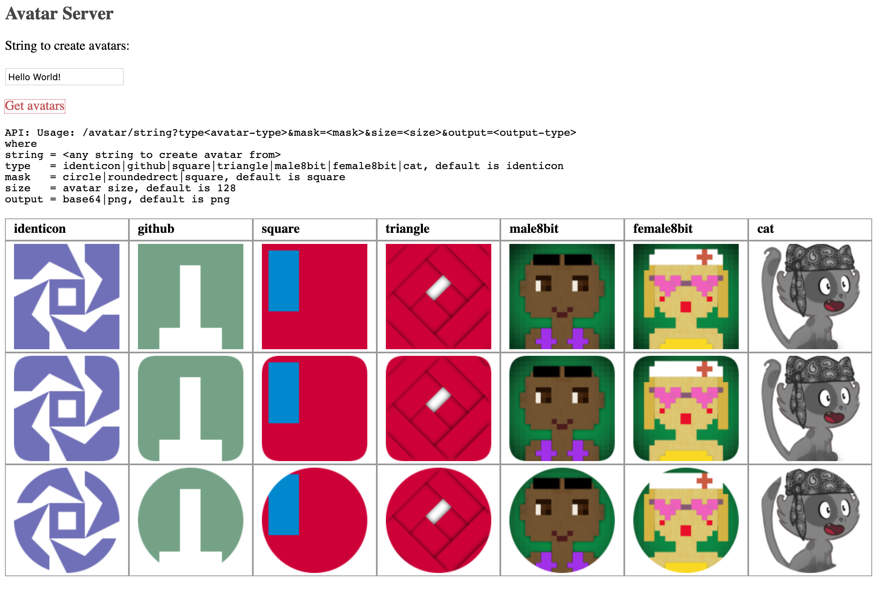

= avatar-server

Avatar server to generate avatars from strings.

* Uses: https://github.com/gabrie-allaigre/node-avatar-builder

== API 

* `http://localhost:8080/avatar/string?mask=<mask>&size=<size>&output=<output-type>`
** where
** `string = <any string to create avatar from>`
** `type   = identicon|github|square|triangle|male8bit|female8bit|cat, default is identicon`
** `mask   = circle|roundedrect|square, default is square`
** `size   = avatar size, default is 128`
** `output = base64|png, default is png`
*** PNG content type: _image/png_
*** Base64 content type: _text/plain_

== Container

* Build container:
** `docker build -t avatar-server .`
* Run container foreground:
** `docker run -it --rm -p 8080:8080 -e DEBUG=true avatar-server`
* Run container background:
** `docker run -d -p 8080:8080 -e DEBUG=true avatar-server`
* Omit `-e DEBUG=true` to disable debug logs.

Avatar-server is also available from Dockerhub:

* `docker run -it --rm -p 8080:8080 -e DEBUG=true kazhar/avatar-server`

